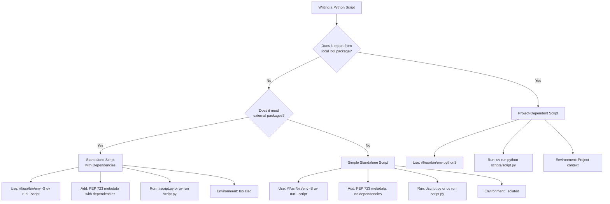
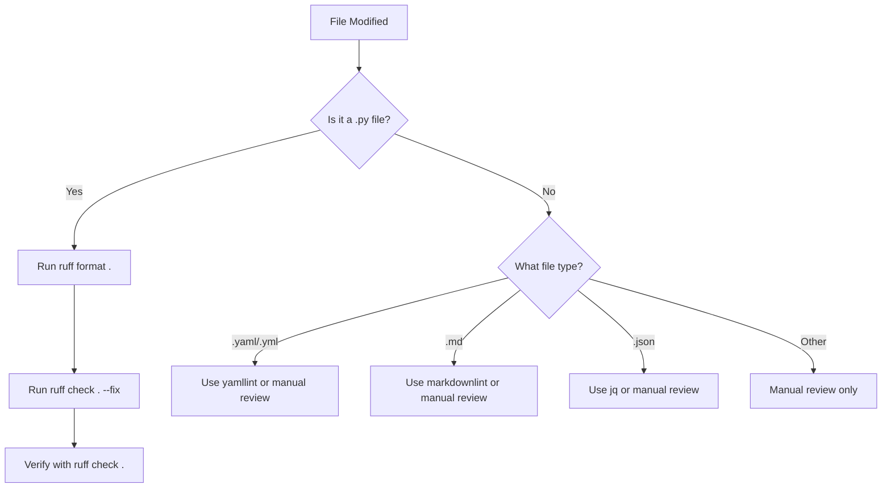
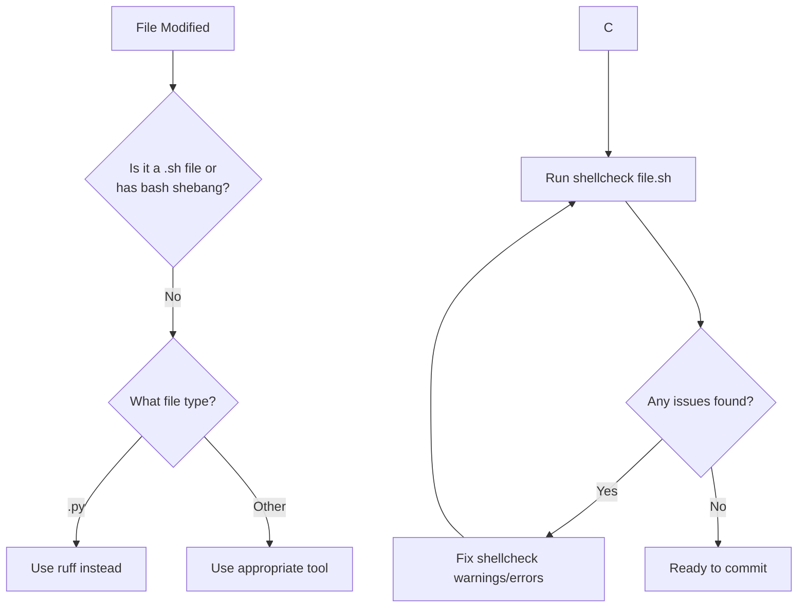
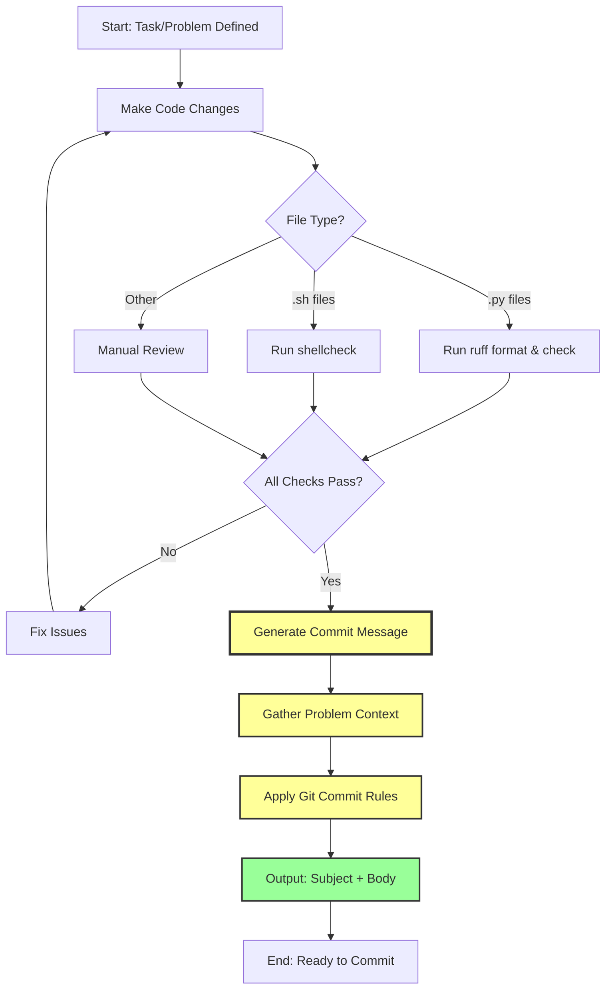

# AGENTS.md - AI Agent Guide

**Last Updated**: 2026-01-02

### Critical Tooling Rules

⚠️ **ALWAYS use `uv` over `pip`**:
- `uv sync` - Install/sync dependencies
- `uv run pytest` - Run tests
- `uv add <package>` - Add new dependency
- `uv run python <script.py>` - Run project-dependent scripts (imports from iotil)
- `uv run <script.py>` - Run standalone scripts with inline metadata

⚠️ **ALWAYS use `ruff` for Python code**:
- `ruff format .` - Format code
- `ruff check . --fix` - Lint and fix issues
- **Note**: Ruff is a Python-specific linter and formatter. Only use it on `.py` files.

⚠️ **File Type Detection**:
- Ruff only works on Python files (`.py`, `.pyi`)
- Before suggesting ruff commands, verify the file extension
- For non-Python files, do NOT use ruff

---

## Coding Conventions

### Python Standards

- **Imports**: Organized by ruff (stdlib → third-party → local)

### Package management with uv

```bash
# Install dependencies
uv sync

# Add new dependency
uv add <package-name>

# Add dev dependency
uv add --dev <package-name>

# Run tests
uv run ./scripts/pytest

# Run scripts
uv run python scripts/generate_test_data.py

# Run Django management commands
uv run python manage.py migrate
```

**Python Script Patterns with uv**:

The project uses two distinct patterns for Python scripts, depending on whether they need access to the local `iotil` package:

#### Pattern 1: Standalone Scripts (External Dependencies Only)

**Use case**: Scripts that only use external packages (httpx, requests, rich, etc.) without importing from `iotil.*`

**Shebang**: `#!/usr/bin/env -S uv run --script`

**Metadata**: PEP 723 inline script metadata with `requires-python` and `dependencies`

**Execution**: `./script.py` (after `chmod +x`) or `uv run script.pyu

**Environment**: Isolated - project dependencies are ignored

**Example**:
```python
#!/usr/bin/env -S uv run --script
# /// script
# requires-python = ">=3.13"
# dependencies = ["httpx", "requests"]
# ///

import httpx

print(httpx.get("https://example.com"))
```

```bash
chmod +x script.py
./script.py
```

#### Pattern 2: Project-Dependent Scripts (Local Package Imports)

**Use case**: Scripts that import from `iotil.*` modules or require Django setup

**Shebang**: `#!/usr/bin/env python3` (traditional)

**Metadata**: None needed (uses [`pyproject.toml`](pyproject.toml))

**Execution**: `uv run python scripts/script.py`

**Environment**: Project context - `iotil` package installed automatically

**Example**:
```python
#!/usr/bin/env python3
"""Generate test data for development."""

import os
import sys
from pathlib import Path

# Add parent directory to path
sys.path.insert(0, str(Path(__file__).parent.parent))

# Set up Django
os.environ.setdefault("DJANGO_SETTINGS_MODULE", "iotil.settings")
import django
django.setup()

# Now import from project
from iotil.core.models import Assessment, Build
from iotil.compliance import all_suites_short_form

# Script logic here...
```

```bash
uv run python scripts/generate_test_data.py
```

**Examples in this project**:
- [`scripts/verify_v3_1_1_parsing.py`](scripts/verify_v3_1_1_parsing.py) - Requires Django setup and compliance suite imports
- [`scripts/generate_lava_job.py`](scripts/generate_lava_job.py) - Imports from `iotil.compliance`
- [`scripts/generate_test_data.py`](scripts/generate_test_data.py) - Imports from `iotil.core.models`

#### Decision Tree



#### Comparison Table

| Aspect | Standalone Script | Project-Dependent Script |
|--------|------------------|-------------------------|
| **Shebang** | `#!/usr/bin/env -S uv run --script` | `#!/usr/bin/env python3` |
| **Metadata** | PEP 723 inline (`# /// script`) | None (uses [`pyproject.toml`](pyproject.toml)) |
| **Dependencies** | External packages only | Project + external packages |
| **Imports** | `import httpx`, `import requests` | `from iotil.core import models` |
| **Execution** | `./script.py` or `uv run script.py` | `uv run python scripts/script.py` |
| **Environment** | Isolated (project ignored) | Project context (iotil installed) |
| **Use Cases** | Utilities, data fetchers, formatters | Django scripts, test generators, LAVA tools |
| **Examples** | Simple HTTP client, JSON processor | [`verify_v3_1_1_parsing.py`](scripts/verify_v3_1_1_parsing.py), [`generate_lava_job.py`](scripts/generate_lava_job.py) |

#### Django Setup Pattern for Project Scripts

Scripts that import from `iotil.*` modules must set up Django before importing. This requires suppressing E402 errors with `# noqa: E402` comments:

**Pattern**:
```python
#!/usr/bin/env python3
import os
import sys
from pathlib import Path

# Django setup MUST come before iotil imports
sys.path.insert(0, str(Path(__file__).parent.parent))
os.environ.setdefault("DJANGO_SETTINGS_MODULE", "test.settings")
import django
django.setup()

# Suppress E402 for imports after Django setup
from iotil.compliance.suites.system_ready.base import format_json  # noqa: E402
from iotil.core.models import Assessment  # noqa: E402
```

**Examples**: [`scripts/verify_v3_1_1_parsing.py`](scripts/verify_v3_1_1_parsing.py), [`scripts/generate_test_data.py`](scripts/generate_test_data.py), [`scripts/generate_lava_job.py`](scripts/generate_lava_job.py)

### Code Quality with ruff (Python Only)

**Note**: Ruff only works on Python files. Do not run these commands on YAML, Markdown, JSON, or other non-Python files.

```bash
# Format all Python files
ruff format .

# Check linting issues
ruff check .

# Auto-fix linting issues
ruff check . --fix

# Check formatting without modifying
ruff format --check
```

### Mandatory Ruff Checks

⚠️ **ALWAYS run ruff after making Python code changes**:

1. **Before committing Python files**: Run `ruff format .` and `ruff check . --fix`
2. **After editing Python files**: Verify no new issues with `ruff check .`
3. **In CI/CD**: Pre-commit hooks automatically enforce ruff checks
4. **File type check**: Only run ruff if you modified `.py` files

**Common ruff patterns in this project**:

- **Django setup scripts**: Use `# noqa: E402` for imports after `django.setup()`
  ```python
  import django
  django.setup()

  from iotil.core.models import Assessment  # noqa: E402
  ```
- **Test files**: `test/settings.py` ignores F403/F405 (see [`pyproject.toml`](pyproject.toml) lines 86-87)
- **Migrations**: Excluded from ruff checks (see [`pyproject.toml`](pyproject.toml) line 79)

### When to Use Ruff

| File Type | Extension | Use Ruff? | Tool to Use Instead |
|-----------|-----------|-----------|---------------------|
| Python source | `.py`, `.pyi` | ✅ Yes | `ruff format`, `ruff check` |
| YAML | `.yaml`, `.yml` | ❌ No | Manual review or yamllint |
| Markdown | `.md` | ❌ No | Manual review or markdownlint |
| JSON | `.json` | ❌ No | Manual review or jq |
| TOML | `.toml` | ❌ No | Manual review |
| Shell scripts | `.sh` | ❌ No | shellcheck |
| Jinja2 templates | `.jinja2` | ❌ No | Manual review |

**Decision Flow**:


### Ruff Best Practices for AI Agents

1. **Check file extension first**: Before suggesting ruff, verify the file ends with `.py` or `.pyi`
2. **Scope appropriately**:
   - Use `ruff format .` and `ruff check .` for project-wide checks
   - Use `ruff format path/to/file.py` for single file checks
3. **Understand exclusions**: Ruff automatically excludes directories listed in [`pyproject.toml`](pyproject.toml) (migrations, venv, etc.)
4. **Don't suggest ruff for**:
   - Configuration files (YAML, TOML, JSON)
   - Documentation (Markdown, RST)
   - Templates (Jinja2, HTML)
   - Shell scripts
5. **Pre-commit hooks**: Remember that pre-commit hooks automatically run ruff on Python files during commit

### Shell Scripting Standards

⚠️ **ALWAYS `shellcheck` for shell scripts**:
- `shellcheck <file.sh>` - Lint and check for issues
- **Note**: These tools only work on shell script files (`.sh`, bash scripts)

#### Shell Script Best Practices

**Linting with shellcheck**:
- Fix all shellcheck warnings and errors
- Common patterns in this project:
  - Use `#!/usr/bin/env bash` shebang
  - Include `set -euo pipefail` for safety
  - Use functions for code organization
  - Proper error handling with traps

**Example shell script structure**:
```bash
#!/usr/bin/env bash
set -euo pipefail

# Function definitions
cleanup() {
  local exit_code=$?
  # Cleanup logic
  exit "$exit_code"
}

trap cleanup EXIT

# Main logic
main() {
  # Script implementation
}

main "$@"
```

#### When to Use Shell Script Tools

| File Type | Extension | Use shellcheck? | Notes |
|-----------|-----------|----------------------|-------|
| Bash scripts | `.sh` | ✅ Yes | Always lint |
| Shell scripts | No extension, `#!/bin/bash` | ✅ Yes | Check shebang |
| Python | `.py` | ❌ No | Use ruff instead |
| Other | `.yaml`, `.md`, etc. | ❌ No | Use appropriate tools |

#### Mandatory Shell Script Checks

⚠️ **ALWAYS run shellcheck after modifying shell scripts**:

1. **Before committing shell scripts**: Fix all `shellcheck` issues
2. **After editing shell scripts**: Verify with `shellcheck <file.sh>`
3. **In CI/CD**: Pre-commit hooks automatically enforce these checks
4. **File type check**: Only run on `.sh` files or files with bash shebang

**Shell Script Decision Flow**:


## Maintenance Instructions

### When to Update AGENTS.md

- ✅ Changes to tooling (uv, ruff, shellcheck, pytest configuration)

### Update Process

1. **Identify Changes**: Review what was added/modified
2. **Update Root AGENTS.md**:
   - Update relevant sections (overview, stack, structure, conventions)
   - Add new concepts or patterns
3. **Update Timestamp**: Update "Last Updated" date in header

### Maintenance Checklist

- [ ] Root AGENTS.md updated with new information
- [ ] Script patterns verified (standalone vs project-dependent)
- [ ] Formatted with ruff (if Python files were modified)
- [ ] Shell scripts pass shellcheck (if .sh files were modified)
- [ ] Timestamp updated
- [ ] Generate commit message using problem context and Git Commit rules (see below)

## Commit Message Generation Workflow

### When to Generate Commit Messages

Commit message generation is a **mandatory final step** that must occur after all other work is complete:

- **After all code changes**: All file modifications, additions, and deletions are finalized
- **After quality checks pass**: All ruff, shellcheck, and other validation tools have been run successfully
- **After maintenance tasks**: All checklist items above are completed
- **Before committing**: This is the last step before the actual git commit

This is not optional—every completed task must have a properly formatted commit message generated according to the rules below.

### Required Context for Generation

When generating a commit message, use the following as input:

- **Problem statement**: The original issue, bug report, or task description that motivated the change
- **Observations**: Any findings discovered during implementation (e.g., "Currently, the parser fails to handle...")
- **Solution approach**: The high-level strategy taken to solve the problem (e.g., "Introduce a new validation step...")
- **Affected subsystems**: File paths and components modified (determines the subject line prefix)

This context directly feeds into the "Problem → Solution" pattern required by the Git Commit rules.

### Applying the Rules

All commit messages must follow the formatting and content guidelines in the **Git Commit rules** section below. Key requirements:

- **Subsystem prefix**: Derive from file paths (e.g., `compliance:`, `scripts:`, `docs:`)
- **Imperative mood**: "Fix bug" not "Fixed bug" or "Fixes bug"
- **Problem → Solution structure**: First paragraph explains the problem/context, second paragraph explains the solution
- **No external links**: Never include http/https URLs in the commit body
- **No literal code changes**: Explain *why*, not *how* (the diff shows how)
- **Character limits**: Subject line 70-75 chars, body wrapped at 72 chars

### Workflow Diagram



**Key Points**:
- Commit message generation (highlighted in yellow) happens **only after** all quality checks pass
- The process requires gathering problem context before applying formatting rules
- The output is a complete commit message (subject + body) ready for use
- This is the final step before the actual git commit operation

### Git Commit rules

Use the plan observation and problem that will be solve as context to generate a commit message based on strictly these rules:

**Format & Style:**
*   **Subject Line:**
    *   Start with the correct subsystem prefix based on the file paths (e.g., `compliance:`, `scripts:`, `tests:`).
    *   Be imperative (e.g., "Fix memory leak" not "Fixed memory leak").
    *   Capitalize the first letter after the prefix.
    *   No trailing period.
    *   Limit to 70-75 characters.
*   **Body:**
    *   Wrap text strictly at 72 characters.
    *   Separate the subject from the body with a blank line.
    *   Use the imperative mood.

**Content & Logic (The "Why"):**
*   **Structure:** Follow the "Problem -> Solution" pattern.
    *   *Paragraph 1:* Explain the context and the problem. Why is this change necessary? What happens if this isn't applied? (e.g., "Currently, the driver fails to reset...")
    *   *Paragraph 2:* Explain the solution at a high level. (e.g., "Introduce a lock to protect...")
*   **No External Links:** Do not include URLs (http/https) in the body. If you must reference an external discussion or bug report, describe it textually or reference a Commit ID/CVE ID, but never a raw link.
*   **No "How":** Do not describe the code changes literally (e.g., "Avoid saying 'Change x to y'"). The diff shows *how*; you must explain *why*.

**Output:**
*   Return *only* the commit message (Subject + Body).
*   Do not include the diff or the list of changed files in the output.
